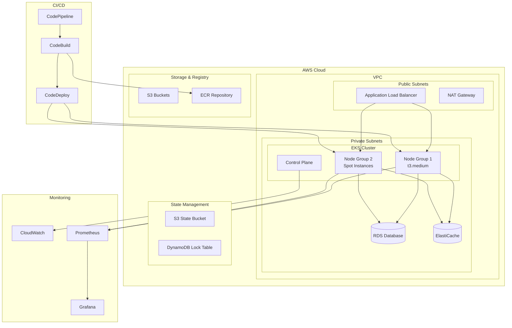

# 🚀 Projeto DevOps-001
**Infraestrutura AWS Completa com Terraform e Ansible**

[](https://terraform.io)
[](https://aws.amazon.com)
[](https://kubernetes.io)
[](https://ansible.com)

---

## 📋 Visão Geral

Este projeto implementa uma **infraestrutura completa na AWS** usando **Infrastructure as Code (IaC)** com Terraform e automação com Ansible. O objetivo é criar um **cluster Kubernetes (EKS)** robusto e escalável para hospedar aplicações modernas, seguindo as melhores práticas de DevOps e segurança.

### 🎯 **Objetivos Principais**
- ✅ **Infraestrutura como Código** com Terraform
- ✅ **State Remoto** seguro (S3 + DynamoDB)
- ✅ **Dynamic Blocks** para máxima flexibilidade
- ✅ **Cluster Kubernetes** gerenciado (EKS)
- ✅ **Automação** com Ansible
- ✅ **Pipelines CI/CD** para infraestrutura e aplicações
- ✅ **Security Groups** configuráveis
- ✅ **Multi-ambiente** (dev, staging, prod)

---

## 🏗️ Arquitetura



---

## 📁 Estrutura do Projeto

```
DevOps-001/
├── 📄 README.md                          # Este arquivo
├── 📄 RELATORIO-SESSAO-16-08-2024.md    # Relatório detalhado da implementação
├── 📄 .gitignore                         # Arquivos ignorados pelo Git
│
├── 🗂️ Terraform/                         # Infraestrutura como Código
│   ├── 0-TerraformState/                 # ✅ State Remoto (S3 + DynamoDB)
│   ├── 1-VPC/                           # ✅ Virtual Private Cloud
│   ├── 1a-SegGroup/                     # ✅ Security Groups (Dynamic Blocks)
│   ├── 1b-IAM/                          # 🔄 IAM Roles e Policies
│   ├── 3-RDS/                           # 🔄 Banco de Dados
│   ├── 3a-Orquestrador/                 # 🔄 Orquestração
│   ├── 3b-EC2/                          # 🔄 Instâncias EC2
│   ├── 4-Bucket/                        # 🔄 S3 Buckets
│   ├── 5-ECR/                           # 🔄 Container Registry
│   ├── 6-ECS/                           # 🔄 Container Service
│   └── 7-EKS/                           # ✅ Kubernetes Cluster (Completo)
│
├── 🗂️ Ansible/                          # Automação e Configuração
│   ├── playbooks/                       # Playbooks de automação
│   ├── roles/                           # Roles reutilizáveis
│   └── inventory/                       # Inventários de hosts
│
├── 🗂️ k8s/                              # Manifests Kubernetes
│   ├── applications/                    # Aplicações
│   ├── monitoring/                      # Monitoring stack
│   └── ingress/                         # Ingress controllers
│
├── 🗂️ docker/                           # Dockerfiles e Compose
│   └── applications/                    # Aplicações containerizadas
│
└── 🗂️ group_vars/                       # Variáveis do Ansible
    ├── all.yml                          # Variáveis globais
    └── environments/                    # Variáveis por ambiente
```

**Legenda:**
- ✅ **Implementado e Testado**
- 🔄 **Em Desenvolvimento**
- ⏳ **Planejado**

---

## 🛠️ Módulos Terraform

### **✅ 0-TerraformState** - State Remoto
**Status:** Implementado e Funcionando
```hcl
# Recursos criados:
- S3 Bucket: crfjunior-terraform-state-bia
- DynamoDB Table: terraform-state-lock
- Versionamento e Criptografia habilitados
```

### **✅ 1-VPC** - Virtual Private Cloud
**Status:** Implementado
```hcl
# Recursos:
- VPC com subnets públicas e privadas
- Internet Gateway e NAT Gateway
- Route Tables configuradas
- Multi-AZ para alta disponibilidade
```

### **✅ 1a-SegGroup** - Security Groups
**Status:** Implementado com Dynamic Blocks
```hcl
# Recursos criados (16/08/2024):
- bia-dev: sg-0f63636bf8bd5d33e (SSH, HTTP 3001)
- bia-alb: sg-0ebea998353b0dcf6 (HTTP, HTTPS)
- bia-web: sg-07b022d4edc05ed05 (HTTP, HTTPS)
- bia-build: sg-078d4e95fb83e0d46 (All traffic)
- bia-dev-mssql: sg-07f809ddeb0346bc4 (MSSQL, SSH)
- bia-ec2: sg-0367689a9b87e5e7b (Full access from ALB)
- bia-db: sg-046148737ad2695e2 (PostgreSQL, MSSQL)
- windows-sg: sg-09bfa769d6e288ed2 (RDP, HTTP, HTTPS)
```

**Características:**
- ✅ **Dynamic Blocks** para máxima flexibilidade
- ✅ **Referências entre Security Groups** sem dependências circulares
- ✅ **Configuração via variáveis** para diferentes ambientes
- ✅ **Suporte a CIDR e Security Groups** opcionais

### **✅ 7-EKS** - Kubernetes Cluster
**Status:** Validado e Pronto para Deploy
```hcl
# Recursos planejados (21 recursos):
- EKS Cluster: bia-eks-cluster (Kubernetes 1.28)
- Node Group: general (2x t3.medium, auto-scaling 1-4)
- IAM Roles: cluster-role, node-group-role
- Security Groups: cluster-sg, nodes-sg, alb-sg
- Addons: vpc-cni, coredns, kube-proxy, aws-ebs-csi-driver
```

**Características Avançadas:**
- ✅ **Dynamic Blocks** para configuração flexível
- ✅ **Multi Node Groups** com diferentes configurações
- ✅ **Spot Instances** suportadas
- ✅ **Auto Scaling** configurável
- ✅ **Taints e Tolerations** para workloads específicos
- ✅ **Launch Templates** opcionais
- ✅ **Remote Access** configurável
- ✅ **Fargate** opcional
- ✅ **Logging completo** habilitado
- ✅ **Encryption** suportada

---

## 🚀 Como Usar

### **Pré-requisitos**
```bash
# Ferramentas necessárias
- Terraform >= 1.0
- AWS CLI configurado
- kubectl
- Ansible (para automação)
- Docker (para aplicações)
```

### **1. Configuração Inicial**
```bash
# Clone o repositório
git clone <repository-url>
cd DevOps-001

# Configure as credenciais AWS
aws configure

# Verifique a configuração
aws sts get-caller-identity
```

### **2. Deploy da Infraestrutura**

#### **State Remoto (Primeira vez apenas)**
```bash
cd Terraform/0-TerraformState
terraform init
terraform plan
terraform apply
```

#### **VPC (Se não existir)**
```bash
cd ../1-VPC
terraform init
terraform plan
terraform apply
```

#### **Security Groups**
```bash
cd ../1a-SegGroup
terraform init
terraform plan
terraform apply
```

#### **EKS Cluster**
```bash
cd ../7-EKS

# Configurar variáveis (opcional)
cp terraform.tfvars.example terraform.tfvars
# Editar terraform.tfvars conforme necessário

# Deploy
terraform init
terraform plan
terraform apply
```

### **3. Configuração do Kubernetes**
```bash
# Configurar kubectl
aws eks update-kubeconfig --region us-east-2 --name bia-eks-cluster

# Verificar cluster
kubectl get nodes
kubectl get pods -A

# Verificar addons
kubectl get daemonset -n kube-system
```

### **4. Deploy de Aplicações**
```bash
# Exemplo: Deploy do Nginx
kubectl create deployment nginx --image=nginx
kubectl expose deployment nginx --port=80 --type=LoadBalancer

# Verificar serviços
kubectl get services
```

---

## 💰 Estimativa de Custos

### **Custos Mensais (USD)**
| Componente | Especificação | Custo Estimado |
|------------|---------------|----------------|
| **EKS Control Plane** | 1 cluster | $73.00 |
| **EC2 Instances** | 2x t3.medium (ON_DEMAND) | $60.00 |
| **EBS Storage** | 2x 20GB gp3 | $4.00 |
| **VPC** | NAT Gateway | $32.00 |
| **Data Transfer** | Estimado | $5.00 |
| **CloudWatch Logs** | Logging habilitado | $3.00 |
| **S3 State** | Terraform state | $1.00 |
| **DynamoDB** | State locking | $0.50 |
| **Total Base** | | **~$178.50** |

### **Otimizações de Custo**
- 🔄 **Spot Instances** para dev/test (-60% nos nodes)
- 🔄 **Fargate** para workloads específicos
- 🔄 **Auto Scaling** baseado em métricas
- 🔄 **Reserved Instances** para produção (-40%)

---

## 🔐 Segurança

### **Implementado**
- ✅ **Security Groups** com princípio do menor privilégio
- ✅ **IAM Roles** específicas para cada componente
- ✅ **VPC** com subnets privadas
- ✅ **State remoto** criptografado
- ✅ **EKS** com logging habilitado

### **Planejado**
- 🔄 **AWS WAF** para proteção de aplicações
- 🔄 **GuardDuty** para detecção de ameaças
- 🔄 **Secrets Manager** para credenciais
- 🔄 **Network Policies** no Kubernetes
- 🔄 **Pod Security Standards**

---

## 📊 Monitoramento

### **Planejado**
- 🔄 **Prometheus + Grafana** para métricas
- 🔄 **ELK Stack** para logs
- 🔄 **Jaeger** para tracing
- 🔄 **AlertManager** para alertas
- 🔄 **CloudWatch** integration

---

## 🔄 CI/CD Pipeline

### **Infraestrutura Pipeline**
```yaml
# Planejado
stages:
  - validate: terraform validate
  - plan: terraform plan
  - security: checkov scan
  - apply: terraform apply (manual approval)
```

### **Application Pipeline**
```yaml
# Planejado
stages:
  - build: docker build
  - test: unit tests
  - security: container scan
  - push: ECR push
  - deploy: kubectl apply
```

---

## 🧪 Testes

### **Infraestrutura**
```bash
# Terraform
terraform validate
terraform plan
checkov -f main.tf

# Kubernetes
kubectl get nodes
kubectl get pods -A
kubectl cluster-info
```

### **Aplicações**
```bash
# Health checks
kubectl get deployments
kubectl get services
kubectl logs -f deployment/app-name
```

---

## 📚 Documentação Adicional

- 📄 **[Relatório de Implementação](RELATORIO-SESSAO-16-08-2024.md)** - Detalhes da sessão de 16/08/2024
- 📄 **[EKS Module README](Terraform/7-EKS/README.md)** - Documentação completa do módulo EKS
- 📄 **[Security Groups Guide](Terraform/1a-SegGroup/CORREÇÕES-APLICADAS.md)** - Guia de correções aplicadas

---

## 🤝 Contribuição

### **Como Contribuir**
1. Fork o projeto
2. Crie uma branch para sua feature (`git checkout -b feature/AmazingFeature`)
3. Commit suas mudanças (`git commit -m 'Add some AmazingFeature'`)
4. Push para a branch (`git push origin feature/AmazingFeature`)
5. Abra um Pull Request

### **Padrões**
- ✅ **Terraform**: Usar dynamic blocks quando possível
- ✅ **Naming**: Seguir convenções AWS
- ✅ **Security**: Princípio do menor privilégio
- ✅ **Documentation**: Documentar todas as mudanças
- ✅ **Testing**: Validar com `terraform validate` e `terraform plan`

---

## 🐛 Troubleshooting

### **Problemas Comuns**

#### **Terraform State Lock**
```bash
# Se o state estiver travado
terraform force-unlock <LOCK_ID>
```

#### **EKS Nodes não aparecem**
```bash
# Verificar IAM roles
aws iam get-role --role-name bia-eks-cluster-node-group-role

# Verificar security groups
aws ec2 describe-security-groups --group-ids sg-xxx
```

#### **kubectl não conecta**
```bash
# Reconfigurar kubectl
aws eks update-kubeconfig --region us-east-2 --name bia-eks-cluster --profile default
```

---

## 📈 Roadmap

### **Fase 1 - Infraestrutura Base** ✅
- [x] State remoto
- [x] VPC e networking
- [x] Security Groups com dynamic blocks
- [x] EKS cluster completo

### **Fase 2 - Serviços Complementares** 🔄
- [ ] RDS Database
- [ ] ElastiCache
- [ ] ECR Repository
- [ ] Application Load Balancer

### **Fase 3 - Aplicações** ⏳
- [ ] Deploy de aplicação exemplo
- [ ] Ingress Controller
- [ ] Cert-Manager
- [ ] External DNS

### **Fase 4 - Observabilidade** ⏳
- [ ] Prometheus + Grafana
- [ ] ELK Stack
- [ ] Jaeger tracing
- [ ] AlertManager

### **Fase 5 - CI/CD** ⏳
- [ ] CodePipeline para infraestrutura
- [ ] CodePipeline para aplicações
- [ ] GitOps com ArgoCD
- [ ] Automated testing

---

## 📞 Contato

**Projeto:** DevOps-001  
**Autor:** Junior  
**Última Atualização:** 16/08/2024  

---

## 📄 Licença

Este projeto está sob a licença MIT. Veja o arquivo [LICENSE](LICENSE) para mais detalhes.

---
Sections
Ansible - IT automation tool to configure systems, deploy software, and orchestrate IT tasks.

Docker - Package applications as portable container images to run in any environment.

Kubernetes - Container orchestrator to run applications in scalable environments.

Terraform - Infrastructure as code software to plan, deploy and manage infrastructure.

Vagrant - Automate development environments, packages, operating system configuration, users, and more.
---

## 🏆 Status do Projeto


**Última atualização:** 16 de Agosto de 2024, 21:45 UTC  
**Próxima milestone:** Deploy do cluster EKS em produção
